# 
# Ecommerce Application Checklist

## Database Design

- [ ] Create an ER diagram of the database
- [ ] Write Create table scripts [script](path/to/sql/file)

- [ ] ER Diagram: https://iili.io/HtJPsG2.png
## Project Setup

- [ ] Create a new Java project
- [ ] Set up a MySQL database
- [ ] Add necessary libraries
	- [ ] JDBC, 
	- [ ] MySQL Connector, 
	- [ ] JUnit, 
	- [ ] Dotenv

## Module 1: User

* Attributes
	* int user_id
	* String name
	* long phone number
	* String email
	* String password
	* String role
	* String address
	* int age

### Feature 1 : Create User  

### User story :
		User created successfully and the user details will be stored in database.

### Pre-requisites:- [ ] user DAO(create user)

- [ ] user table
- [ ] user model
- [ ] user DAO
- [ ] user service ( create )

#### Validations:  

- [ ] Form validator  
	* user ( null )  
	* name ( null, empty, pattern )  
	* email ( null, empty, pattern )  
	* password ( null, empty, pattern )  
	* phone number ( length, >= 600000001 && <= 9999999999 )
 
- [ ] Business Validation  
	* Phone number already exists
	* Email Already exists

#### Messages:  

* User object cannot be null  
* Name cannot be null or empty
* Name should be match with the given pattern
* Email cannot be null or empty
* Email Should be match with the given pattern
* Phone number should  be match with the given pattern
* Password cannot be null or empty
* Password must contains at least 8 characters
* Password should be match with the given pattern 
* User already exists  

#### Flow:  
> Invalid When a user's phone number is already in use or when the input provided does not meet the criteria, users arise.

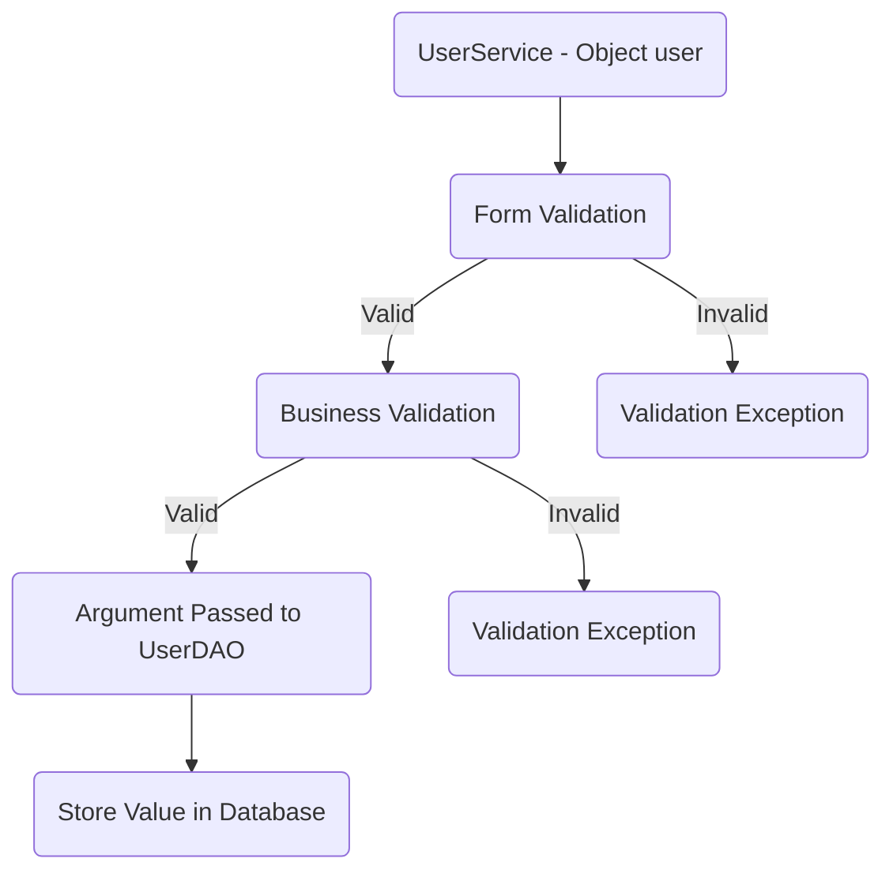
### Feature 2 : Update User  

### User story :
		User details successfully updated and stored in database.

### Pre-requisites:- [ ] user DAO(update user)  

- [ ] completed feature 1 - create user
- [ ] user dao ( update )
- [ ] user service ( update ) 

#### Validations:  

- [ ] Form validator  
	*  id (less than or equal to 0) 
	* name ( null, empty, pattern )  
	* password (null , empty, pattern )

- [ ] Business Validation  
	* Check whether the id exist

#### Messages:  

* Id cannot be 0 or in negative  
* Email cannot be null or empty
* Email should be match with the given pattern
* Phone number should match with the given pattern
*  Name cannot be null or empty
* Name should be match with the given pattern
* Password cannot be null or empty
* Password must contains at least 8 characters
* Password should match with the given pattern 
* User not found  

#### Flow:  
> Invalid When a user's phone number or email is not in use or when the input provided does not meet the criteria, users arise.

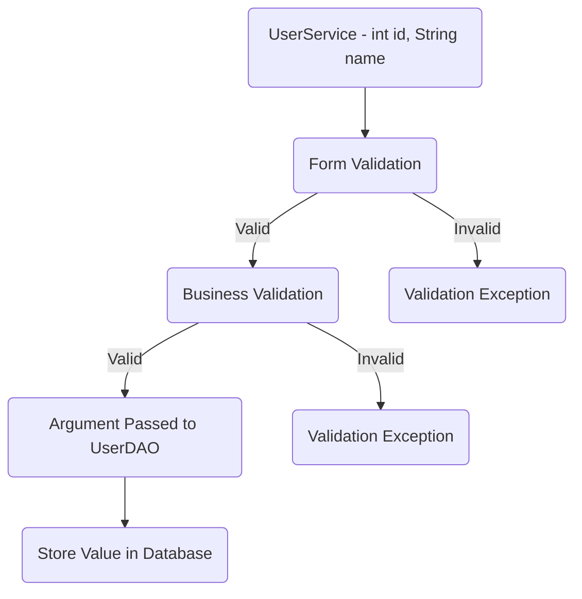
### Feature 3 : Delete User  

### User story :

		User successfully deleted.

### Pre-requisites:- [ ] user DAO(delete user)  

- [ ] completed feature 1 - create user
- [ ] user dao ( delete )
- [ ] user service ( delete )

#### Validations:  

- [ ]  Form Validation 
	* id (less than or equal to 0)
	* phone number (greater than 6000000001 and less than 9999999999)
	* email (null, empty, pattern) 

- [ ] Business Validation  
	* Check whether the id exist

#### Messages:  

* Id cannot be 0 or in negative  
* Email cannot be null or empty
* Email should be match with the given pattern
* Phone number should match with the given pattern
*  Name cannot be null or empty
* Name should be match with the given pattern
* Password cannot be null or empty
* Password must contains at least 8 characters
* Password should match with the given pattern 
* User not found  

#### Flow:  
> Invalid When a user's phone number is not in use or when the input provided does not meet the criteria, users arise.

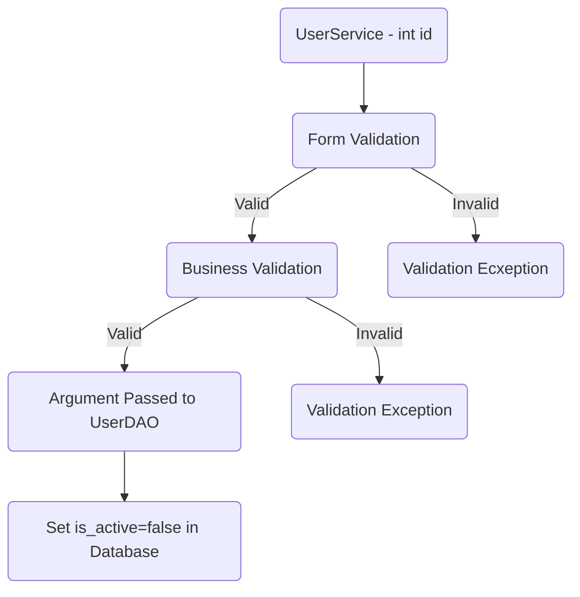
## Module 2: Category

* Attributes  
	* int cate_id; 
	* String name;  

### Feature 4 : Create Category

### User story :

		Category created and successfully category details stored in database.

### Pre-requisites:- [ ] category DAO(create category)  

- [ ] category table
- [ ] category model
- [ ] category DAO
- [ ] category service ( create )

#### Validations:  

- [ ] Form Validation  
	* category null  
	* name ( null, empty, pattern )  

- [ ] Business Validation  
	* Category name Already exists

#### Messages:  

* Category object cannot be null  
* Name cannot be null or empty
* Name should be match with the given pattern  
* Category already exists  

#### Flow:  

> Invalid When a category's name is already in use or when the input provided does not meet the criteria, categories arise.

### Feature 5 : List all categories

### User story :

		List all categories stored in the database.

### Pre-requisites :- [ ] category DAO (findAll category)

- [ ] complete feature 4 - create category
- [ ]  category dao ( find all )
- [ ] category service ( find all )

### Flow:  

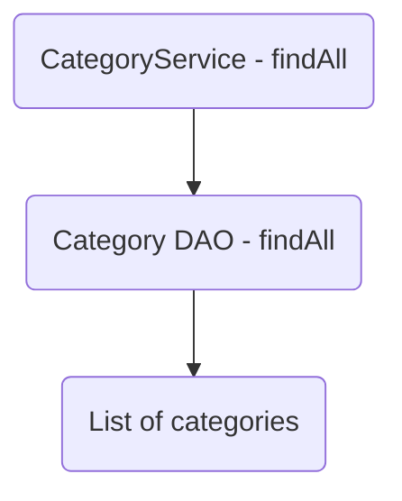

### Feature 6 : Update Category

### User story :

		Category deatils are successfully updated and stored in databse.

### Pre-requisites:- [ ] category DAO(update category)  

- [ ] complete feature 4 - create category
- [ ] category dao ( create )
- [ ] category service ( create )

#### Validations:  

- [ ] Form Validation 
	* id (less than 0) 
	* name ( null, empty, pattern )  

- [ ] Business Validation  
	* Check whether the id exist

#### Messages:  
* Id cannot be 0 or in negative  
* Name cannot be null or empty
* Name should be match with the given pattern   
* Category id does not exists  

#### Flow:  
> Invalid When a category's name is not in use or when the input provided does not meet the criteria, categories arise.

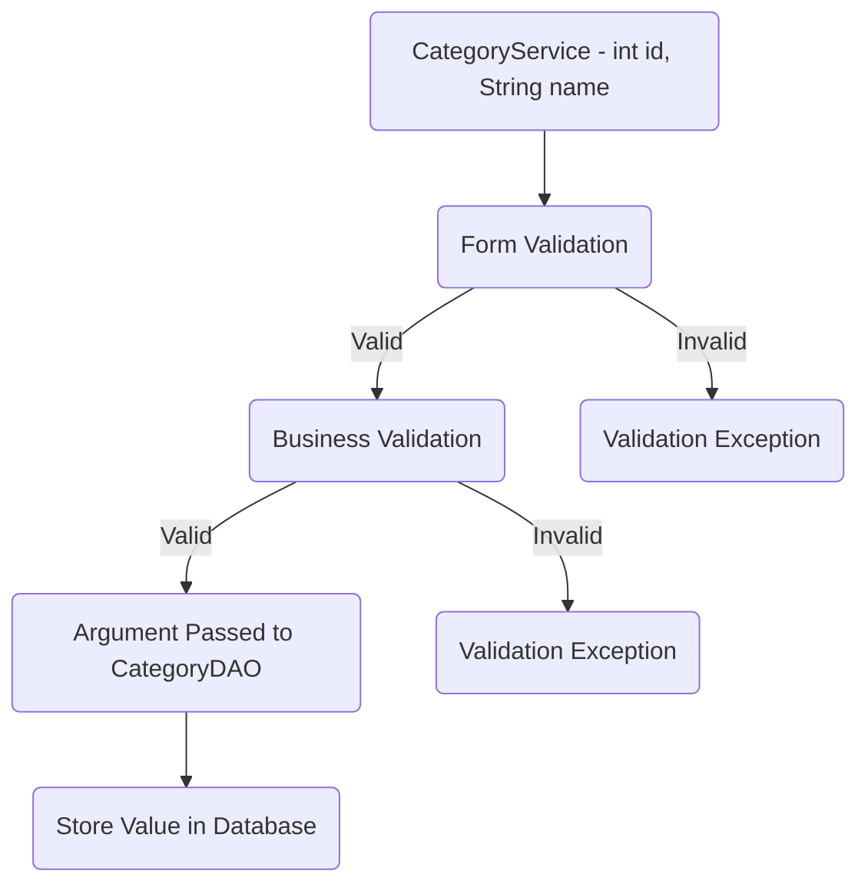
### Feature 7 : Delete Category

### User story :

		Category is deleted successfully.

### Pre-requisites:- [ ] category DAO(delete category)  

- [ ] complete feature 1 - create category
- [ ] category dao ( delete )
- [ ] category service ( delete )

#### Validations:  

- [ ] Form Validation 
	* id (less than or equal to 0) 
	* name (null, empty, pattern)

- [ ]  Business Validation  
	* Check whether the id or name exists

#### Messages:
  
* Id cannot be 0 or in negative
* Name cannot be null or empty
* Name should be match with the given pattern
* Category id or name does not exists 

#### Flow:  
> Invalid When a category's name is not in use or when the input provided does not meet the criteria, categories arise.

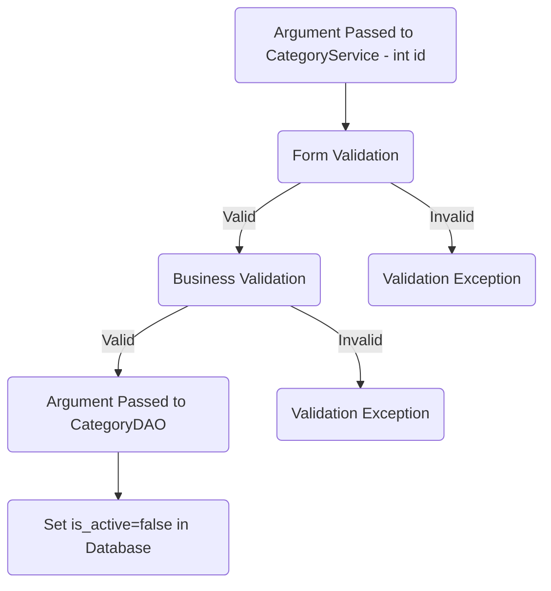
## Module 3: Size

* Attributes  
	* int size_id; 
	* String name;  

### Feature 8 : Create Size

### User story :

		Size is created and the details are successfully stored in database.

### Pre-requisites:- [ ] size DAO(create size)  

- [ ] size table
- [ ] size model
- [ ] size Dao
- [ ] size service ( create )

#### Validations:  

- [ ] Form Validation  
	* size null  
	* name ( null, empty, pattern )  

- [ ]  Business Validation  
	
	* Check the size is already exist or not

#### Messages:
  
* Size object cannot be null  
* Name cannot be null or empty
* Name should be match with the given pattern   
* Size already exists  

#### Flow:  
> Invalid When a size's name is already in use or when the input provided does not meet the criteria, sizes arise.

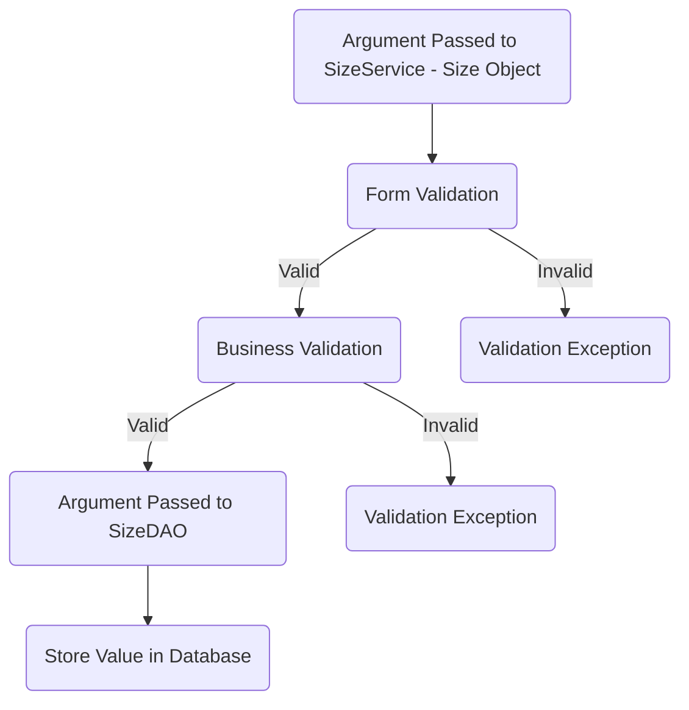
### Feature 9 : List all sizes

### User story :

		List all sizes stored in the database.

### Pre-requisites :- [ ] size DAO (findAll size)

- [ ] complete feature 8 - create size
- [ ]  size dao ( findAll )
- [ ] size service ( findAll )

### Flow:  

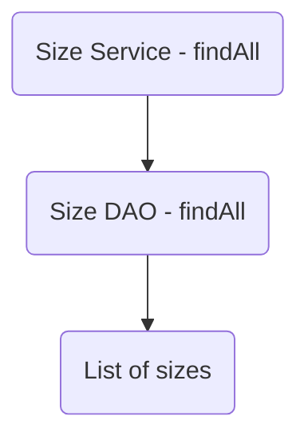

## Module 4: Type

* Attributes  
		* int type_id; 
		* String name;  

### Feature 10 : Create Type

### User Story :
	
		Type is successfully created and the details are stored in database.

### Pre-requisites:- [ ] type DAO(create type)  

- [ ] create type table
- [ ]  type model
- [ ] type dao
- [ ] type service ( create )

#### Validations:  

- [ ]  Form Validation  
	* type null  
	* name ( null, empty, pattern )  

- [ ] Business Validation  
	* Name Already exists

#### Messages:
  
* Type object cannot be null  
* Name cannot be null or empty
* Name should be match with the given pattern  
* Type already exists  

#### Flow:  
> Invalid When a Type's name is already in use or when the input provided does not meet the criteria, types arise.

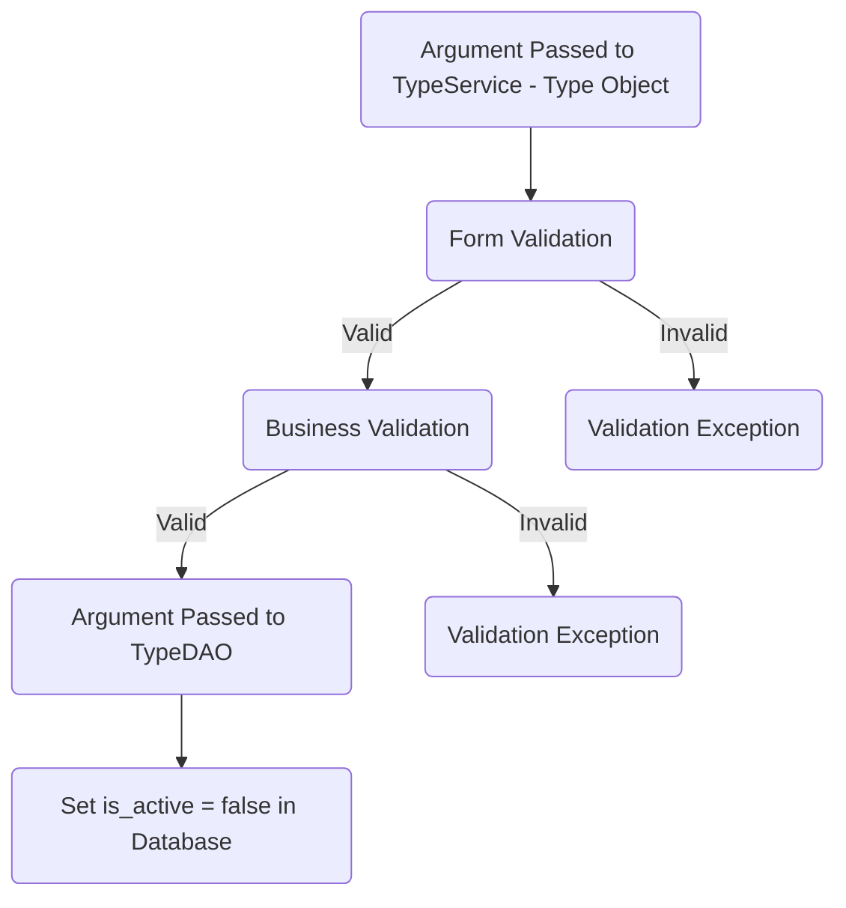

### Feature 11 : List all types

### User story :

		List all types stored in the database.

### Pre-requisites :- [ ] typeDAO (findAll type)

- [ ] complete feature 10 - create type
- [ ]  type dao ( find all )
- [ ] catetype gory service ( find all )

### Flow:  

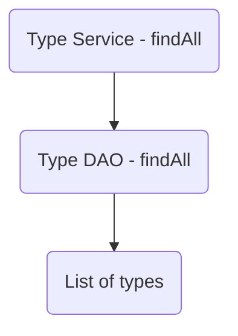

### Feature 12 : Update type

### User  story :

		Type details are successfully updated.

### Pre-requisites:- [ ] type DAO(update type)  

- [ ] complete feature 10 - create type
- [ ] type dao ( update )
- [ ] type service ( update )

#### Validations:  

- [ ] Form Validation 
	* id (less than 0) 
	* name ( null, empty, pattern )  

- [ ] Business Validation  
	* Check whether the id exist

#### Messages:
  
* Id cannot be 0 or in negative
* Name cannot be null or empty
* Name should be match with the given pattern
* Type id or name does not exists  

#### Flow:  
> Invalid When a type's name is not in use or when the input provided does not meet the criteria, types arise.

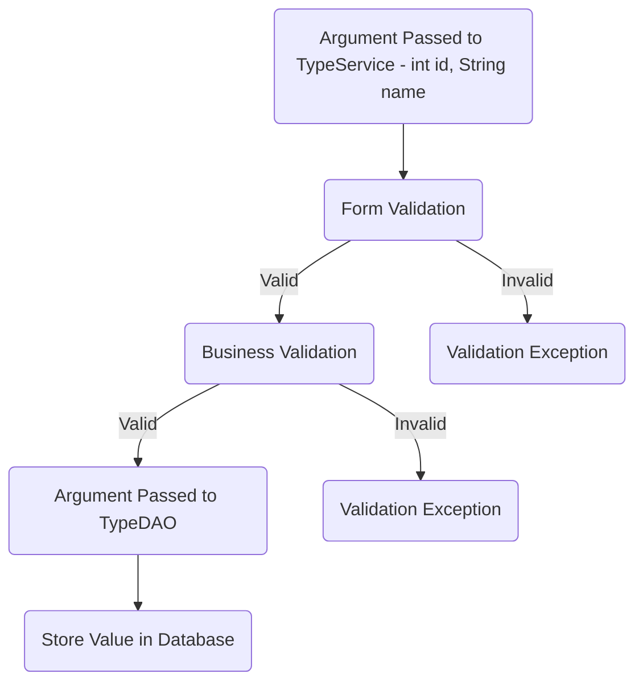
### Feature 13 : Delete type

### User story :

		Type is deleted successfully.

### Pre-requisites:- [ ] type DAO(delete type)  

- [ ] complete feature 1 - create type
- [ ] type dao ( delete )
- [ ] type service ( delete )

#### Validations:  

- [ ] Form Validation 
	* id (less than or equal to 0) 
	* name ( null, empty, pattern )  

- [ ] Business Validation  
	* Check whether the id exist

#### Messages:
  
* Id cannot be 0 or in negative
* Name cannot be null or empty
* Name should be match with the given pattern
* Type id or name does not exists 

#### Flow:  
> Invalid When a Type's name is not in use or when the input provided does not meet the criteria, types arise.

# demoapp-corejava-template
